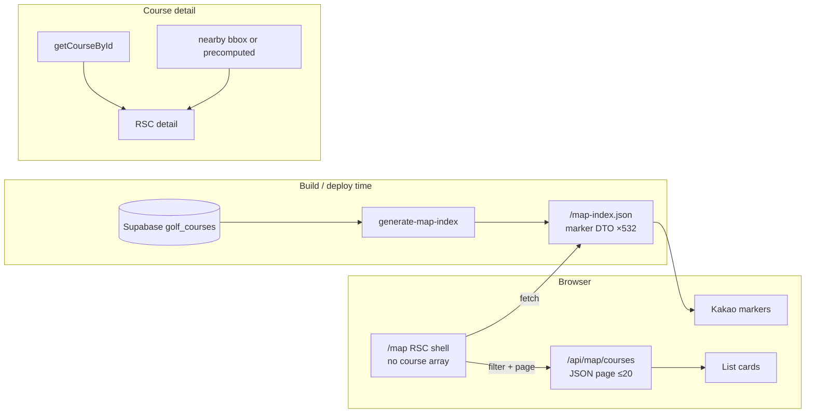

# /map payload redesign (design only — not implemented)

**Status:** design draft  
**Date:** 2026-08-01  
**Context:** PR #22 (column trim + nearby bbox) proved functional but did **not** hit wall/payload goals. Production stays on Worker `be560e3a…` with `cpu_ms=2000`.  
**Out of scope for this doc:** code, new PR, Preview/Production deploy, DNS/Custom Domain/Vercel/env changes, KV (unless later required).

---

## Problem

Every `/map` request currently:

1. Loads (near-)full course rows in the Worker  
2. Serializes **~532** rich DTOs into the RSC/HTML payload (~**3.0–3.1 MB**)  
3. Lets the client filter in memory  

PR #22 reduced payload by only ~**1.7%**. Wall p95 gains were **unstable**. The bottleneck is **RSC serialization of the full catalog**, not Supabase column width alone.

---

## Goals (acceptance for a future implementation)

| Metric | Target |
|--------|--------|
| Initial `/map` HTML+RSC payload | **≤ 500 KB** |
| Marker index (gzip) | **≤ 200 KB** |
| `/map` wall p95 vs baseline `be560e3a` | **≥ 30%** stable improvement (two independent 50× runs) |
| Filter suite (20 queries) ID sets | **Exact match**, flake **0** |
| Errors | **5xx = 0**, **1102 = 0**, **exceededResources = 0** |
| UX | Mobile map/list toggle, filter sheet, URL query state, back/forward preserved |

---

## Recommended architecture

Priority order: **A → B → C**.



### A. Build-time static map index (first)

| Item | Choice |
|------|--------|
| Artifact | e.g. `public/map-index.json` (or OpenNext assets equivalent) |
| Served as | **Static asset** — client `fetch`, not embedded in RSC |
| Fields | Marker/filter minimum only (see DTO below) |
| KV | **Do not use** initially |
| When to consider KV | Only if course data must change **without** a deploy on a short cadence |

**Marker / filter DTO (illustrative):**

```ts
type MapIndexCourse = {
  id: string;
  name: string;
  region: string;
  city: string;
  lat: number;
  lng: number;
  holeCount?: number;
  courseType?: string;
  priceMin?: number;
  tags?: string[]; // keep short; drop free-text description
};
```

Omit: `description`, long addresses if not needed for markers, booking blobs, enrichment, SEO alias arrays.

### B. List data split (with A)

| Surface | Data source |
|---------|-------------|
| Initial `/map` RSC | Shell only: URL-parsed filter state, empty/deferred list — **no 532 array** |
| Markers | Client loads `map-index.json` once (browser cache / `Cache-Control`) |
| List cards | `GET /api/map/courses?…&page=1&pageSize=20` → small JSON page |
| Filter change | Re-query API (and/or filter index client-side for markers only) |

- **Pagination:** 20 items per page for list view  
- **Marker DTO ≠ list card DTO** (list may add `address`, `priceText`, `phone` for the page only)  
- URL state (`q`, region, holes, price, tag, collection, `view`, sort) stays the source of truth  

### C. Course detail

| Concern | Approach |
|---------|----------|
| Primary | `getCourseById` only |
| Nearby | Bbox/range query **or** build-time precomputed top-N neighbors per id |
| Forbidden | Loading all 532 for nearby |
| SSG | Prefer `generateStaticParams` + avoid `noStore()` on the hot path where freshness allows; ISR/R2 later optional |

---

## Data flow

### `/map` (happy path)

1. User hits `/map?…`  
2. Worker returns **light RSC shell** (layout, filter chrome, initial URL state) — **no course list in props**  
3. Client fetches `/map-index.json` (static)  
4. Client applies filters to index → updates markers  
5. If `view=list` (or list panel open): client requests page 1 JSON from API  
6. URL updates on filter/view changes; back/forward restores state and re-derives markers/list  

### Course detail

1. `getCourseById(id)`  
2. Nearby via bbox (runtime) or `nearby-index.json` / per-id blob (build-time)  
3. Render detail + nearby cards  

---

## Cache / refresh

| Asset | Cache | Refresh |
|-------|-------|---------|
| `map-index.json` | Long `Cache-Control` (e.g. `public, max-age=300, stale-while-revalidate=86400`) tunable | Regenerated on **app deploy** / CF build from Supabase |
| `/api/map/courses` | Short private/public cache optional; prefer `no-store` until stable | Live Supabase or filtered slice of index |
| Course detail HTML | SSG/ISR when safe | Redeploy or future R2 ISR |

**KV:** deferred. Revisit only if product requires catalog edits live without deploy.

**Build step (future):** `node scripts/generate-map-index.mjs` in `cf:build` / `prebuild`, asserting count === 532 and gzip size ≤ 200 KB.

---

## Expected payload (order-of-magnitude)

| Piece | Today | Target |
|-------|------:|-------:|
| `/map` HTML+RSC | ~3.0–3.1 MB | **≤ 500 KB** |
| Marker index raw | (inlined) | ~300–600 KB JSON → **≤ 200 KB gzip** |
| List page JSON (20) | n/a | ~10–40 KB |

Wall p95: expect improvement once RSC drops the 532-array serialize; prove with two 50× cold runs vs `be560e3a` on Production or a custom-domain Preview that exposes `Server-Timing`.

---

## Implementation phases (future work — not now)

1. **Index generator + size CI gate** (532 count, gzip ≤ 200 KB)  
2. **`/map` shell without courses prop**; client loads index  
3. **List API + pageSize=20**; wire list UI; keep URL state  
4. **Split marker vs card DTOs**; parity tests (20 filters, exact ID sets)  
5. **Detail nearby** without full catalog; optional SSG cleanup (`noStore` audit)  
6. **Preview Worker** (isolated, no custom domains) → benches → only then Production  

Content work may proceed in parallel; this redesign waits until infra focus returns.

---

## Rollback

| Layer | Action |
|-------|--------|
| Production Worker | Keep / return to **`be560e3a-e842-4dfe-8de7-1c4c55c12078`**: `npx wrangler rollback f38029e5-…` only if a *later* deploy regresses; current baseline is already `be560e3a` |
| Feature flag (optional future) | `NEXT_PUBLIC_MAP_INDEX_MODE=legacy\|static` to serve old RSC path |
| Static index bug | Redeploy previous build artifact; DNS/domains untouched |
| DNS / Custom Domain / Vercel | **Never** part of this redesign rollback |

---

## Explicit non-goals (this pause)

- Implementing A/B/C now  
- Opening a new optimization PR  
- Preview or Production deploy  
- Raising `cpu_ms` above 2000  
- Adopting KV in v1  
