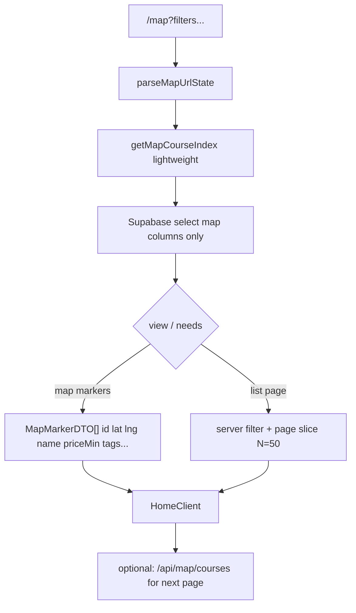

# Workers Paid 전환 준비 (read-only prep — no Production deploy)

**Date:** 2026-08-01  
**Constraint:** DNS / Custom Domain / NS / Vercel 설정 변경 없음.  
**Gate:** 사용자가 `Workers Paid active`라고 회신하기 전까지 Production 재배포 금지.  
**결제:** Dashboard에서 사용자 직접 진행.

---

## 0. 현재 Production 상태 (감사 기준)

| Item | Value |
|------|--------|
| Route | **B — Cloudflare Worker** (`golfmap-korea-preview`) |
| Custom domains | `golfmap.kr`, `www.golfmap.kr` (enabled) |
| Active version | `f38029e5-def7-4b18-9668-e0a0d7e87d70` @ 100% (2026-08-01T08:34:46Z) |
| `usage_model` | `standard` |
| Edge (prod hosts, cutover 이후) | 560 req · 5xx **15** (all 503) · success 466 |
| Script `exceededResources` | 24h **33** / cutover 이후 **26** (workers.dev 혼입 가능) |
| CPU (script, request-weighted) | P50 ≈ **54–63 ms** · weighted P99 ≈ **574–582 ms** |
| Free CPU ceiling | **~10 ms** → P50조차 초과 → 1102 / exceededResources 반복은 구조적 |

---

## 1. wrangler / OpenNext 최종 배포 config 감사

### `wrangler.jsonc` (repo)

```jsonc
{
  "name": "golfmap-korea-preview",
  "main": ".open-next/worker.js",
  "compatibility_date": "2026-07-24",
  "compatibility_flags": ["nodejs_compat"],
  "workers_dev": true,
  "keep_vars": true,
  "vars": { "GOLFMAP_DATA_MODE": "production" },
  "routes": [
    { "pattern": "golfmap.kr", "custom_domain": true },
    { "pattern": "www.golfmap.kr", "custom_domain": true }
  ],
  "assets": { "directory": ".open-next/assets", "binding": "ASSETS", "run_worker_first": false },
  "observability": { enabled: true }
}
```

- **`limits` 블록 없음** → repo에 Free 전용 `cpu_ms` 명시도 없고, Paid custom limit도 없음.
- Deploy path: `npm run cf:deploy` → `scripts/run-cf-deploy.mjs` → build → `opennextjs-cloudflare deploy`.
- OpenNext: `open-next.config.ts` = `defineCloudflareConfig({})` (R2 incremental cache 없음 → `revalidate` ISR durable 아님, build-time SSG/SSR은 동작).

### Live Worker settings (API, read-only)

- `compatibility_date`: `2026-07-24`
- `usage_model`: `standard`
- Bindings: `ASSETS`, `GOLFMAP_DATA_MODE=production`, Supabase/Kakao secrets
- Observability logs: enabled
- **Settings payload에 custom `cpu_ms` / limits 필드 없음**

Artifact: `reports/analytics/worker-settings-readonly.json`

---

## 2–3. Free CPU limit / 낮은 custom limit 위치

| Location | `cpu_ms` / limits? |
|----------|-------------------|
| `wrangler.jsonc` | **없음** |
| Dashboard Worker settings (API) | **없음** (platform Free 기본 ~10ms 적용) |
| `open-next.config.ts` | **없음** |
| Repo 전역 `cpu_ms=10` / `50` 검색 | **해당 커밋된 설정 없음** |

**결론:** 현재 custom CPU limit는 **미설정**. Free 플랜의 **플랫폼 기본 ~10ms**가 사실상 kill switch.  
Paid 전환 전에는 `limits.cpu_ms = 2000`을 wrangler에 **넣지 않음** (Free에서 deploy 거부/무시될 수 있음).

---

## 4. Paid 전환 후 적용할 runtime guard (제안 — 미적용)

사용자가 `Workers Paid active` 회신 후 **그때** `wrangler.jsonc`에 추가:

```jsonc
"limits": {
  "cpu_ms": 2000
}
```

| 값 | 근거 |
|----|------|
| **2000 ms** | 현재 weighted P99 ≈ 580ms · max-bucket P99 ≈ 802ms 대비 ~2.5–3.5× 여유 |
| 상한으로 유지 | runawayaway(무한 루프/거대 serialize) 방지; Paid 기본보다 명시적 가드 |
| 최적화 PR 이후 | 안정화되면 500–1000ms로 단계 하향 검토 가능 |

**적용 순서 (Paid active 이후만):**

1. Dashboard에서 Workers Paid 활성 확인 (`usage` / subscription)
2. `wrangler.jsonc`에 `limits.cpu_ms = 2000` 커밋
3. `npm run cf:deploy` (DNS/domain 변경 없음 — 기존 custom domains 유지)
4. Smoke + data-parity + 경로별 부하 + 30분 관측

---

## 5. `/map` CPU 최적화 설계 (별도 PR — Paid 직후 또는 병행)

### 현재 hot path

```
app/map/page.tsx
  → getCourses()                    // noStore + select("*") 전 532행
  → toHomeCourses()                 // 필드 trim은 하나, 여전히 532개 객체
  → <HomeClient courses={...} />    // RSC payload에 전체 직렬화
  + searchParams → 동적 렌더
```

URL state (`lib/mapUrlState.ts`)는 유지 대상: `q`, `region`, `collection`, `view`, filters, `sort`.

### 목표 아키텍처



### 구체 변경 (PR 단위)

1. **`getMapCourses()` / `getMapCourseIndex()`** in `courseRepository`
   - `select`를 지도·필터에 필요한 컬럼만 (예: `id,name,region,city,address,latitude,longitude,course_type,hole_count,phone,homepage_url,tags,price_min,price_max,price_text,weekday_green_fee_min,night_round,no_caddie,two_player_allowed,resort` — `description` 등 대형 텍스트 제외)
   - `select("*")` 제거
2. **List view pagination**
   - URL에 `page` (또는 기존 state와 호환되는 cursor) 추가 가능하나, **기본은 서버에서 필터 적용 후 상위 N개만 props로 전달**
   - 지도 마커는 경량 DTO 전체(또는 region-scoped) 유지 — 마커는 description 없이 ~수 KB×532 수준으로 축소
3. **서버 사이드 필터**
   - `parseMapUrlState` 결과를 서버에서 적용 → 클라이언트 초기 필터 비용·payload 감소
4. **캐시 전략 (2단계)**
   - 단기: `getCoursesForStaticPages` 스타일로 map index를 build/ISR 후보로 (OpenNext R2 cache 전에도 build snapshot 가능 여부 검토)
   - 중기: R2/KV에 `map-index.json` 두고 Worker는 fetch+filter만
5. **사용자 체감 유지**
   - 동일 필터 URL로 deep link 유지
   - 지도↔리스트 토글·컬렉션/지역 진입 동작 유지
   - data-parity: map count **532** (또는 필터 없을 때 total) 유지

### 비목표 (이 PR에서 하지 않음)

- DNS / domain 변경
- 지도 UX 전면 리디자인
- Supabase schema migration (RPC는 optional follow-up)

---

## 6. Course detail 최적화 설계 (별도 PR)

### 현재 hot path

```
app/courses/[id]/page.tsx
  → getCourseById(id)     // OK, single row — but noStore()
  → getCourses()          // 전체 532 select("*")
  → getNearbyCourses(all, course, 6)  // in-memory haversine
```

`generateStaticParams`가 있어도 `noStore()` 때문에 **요청마다 동적 실행**될 수 있음.

### 목표

1. **상세 1건:** `getCourseById`만 (이미 분리됨) — static 가능하면 `noStore` 제거/완화 검토
2. **Nearby 분리:** `getNearbyCoursesFromSupabase(course, limit=6)`
   - Bounding box: `lat ± δ`, `lng ± δ` (δ ≈ 50km 환산)로 `select` 후 거리 정렬
   - 또는 PostGIS/RPC 없이 단순 range filter + JS haversine on ≤수십 행
3. **절대 금지:** nearby 때문에 `getCourses()` 전체 로드
4. **RegionLinks / blog:** 기존 유지; RegionLinks가 전체 courses를 부르면 별도 경량화

---

## 7. SSG 가능 경로 점검

| Path | 현재 | SSG/ISR 메모 |
|------|------|----------------|
| `/` | 서버 컴포넌트 + `getCoursesForStaticPages` in recommended | Build-time static 후보. `revalidate` 미선언. OpenNext R2 ISR 없음 → deploy 시 스냅샷 의존 |
| `/blog`, `/blog/[slug]` | slug에 `generateStaticParams` + `revalidate=86400` | SSG 강함 (콘텐츠 모듈) |
| `/recommended` | `revalidate=86400` + static courses fetch | SSG/ISR 의도 |
| `/collections/[slug]` | `generateStaticParams` + `revalidate=86400` | SSG 의도 |
| `/regions/[slug]` | 동일 패턴 | SSG 의도 |
| `/courses/[id]` | `generateStaticParams` 있으나 page 내 `noStore` | **사실상 dynamic 위험** → nearby 분리 + noStore 정리 필요 |
| `/map` | `searchParams` + `getCourses`/`noStore` | **항상 dynamic** — 최적화 핵심 |

Paid + cpu_ms=2000 직후에도 `/`·blog·collections는 상대적으로 안전; **`/map`·미캐시 course detail**이 503/exceededResources 주원인으로 보는 것이 타당.

---

## 8. 최적화 전후 측정 계획

### A. Cloudflare GraphQL / `cf:health:24h` (hostname/zone 분리)

- CPU p50 / p95 / p99 (µs→ms; **max-of-buckets 금지**, request-weighted 또는 Dashboard chart)
- `exceededResources` (script) + zone prod **5xx**
- Window: Paid deploy 직후 30분, 24h

### B. 경로별 synthetic (cold / warm 각 50회)

대상: `/`, `/map`, `/courses/{sampleId}` (예: 추천 코스 1개)

측정 헤더:

- `cf-ray`, `server-timing` (`cfWorker` dur)
- status / 1102 body
- cold = 새 URL query + cache-buster; warm = 동일 URL 즉시 재요청

스크립트(후속): `scripts/bench-production-routes.mjs` 제안 — Paid 배포 후 추가·실행.

### C. 합격 기준 (Paid + cpu_ms=2000 직후)

| Metric | Target |
|--------|--------|
| exceededResources (30m, prod-weighted) | **0** |
| Zone 5xx on golfmap.kr/www | **0** |
| `/map` 50× | 200, no 1102 |
| map count | **532** |
| home recommended | **4** |
| blog/course/images smoke | pass |

코드 최적화 PR 추가 합격: `/map`·detail의 `cfWorker` p95가 Free 10ms 대비 여유 있게 Paid 한도 내부로 안정.

---

## 9. Rollback 명령 · Vercel 복구 (재확인)

**원칙:** Vercel 프로젝트/deployment **삭제하지 않음** (≥14일). Primary rollback = DNS/custom-domain 경로 복구 (이번 prep에서는 실행하지 않음).

### Worker-only rollback (DNS 유지, 이전 Worker version)

```bash
npx wrangler rollback --name golfmap-korea-preview
# 또는 특정 version:
npx wrangler rollback <version-id> --name golfmap-korea-preview
```

현재 known-good cutover version: `f38029e5-def7-4b18-9668-e0a0d7e87d70`  
(새 deploy 후 문제 시 이 version으로 rollback 후보)

### DNS → Vercel 복구 (긴급 — 사용자/대시보드; 에이전트는 Paid prep 중 실행 금지)

Runbook: `reports/cloudflare-cutover/rollback-runbook.md`

1. Cloudflare DNS:
   - apex `A` → `216.198.79.1`
   - www `CNAME` → `6d570a1bc5749edb.vercel-dns-017.com`
2. Worker custom domains 제거 (`golfmap.kr`, `www.golfmap.kr`)
3. 검증: `curl -sI https://golfmap.kr` → `Server: Vercel`
4. Rollback URL 상시 확인용: https://golf-course-finder.vercel.app/

### Preview 검증 (Production 비터치)

```bash
npm run cf:build
# workers.dev only if needed — avoid production deploy until Paid active
npm run cf:smoke -- --base https://golfmap-korea-preview.sun15002000.workers.dev
npm run cf:data-parity -- --base https://golfmap-korea-preview.sun15002000.workers.dev
```

---

## Paid active 회신 후 실행 체크리스트 (에이전트)

1. Paid 상태 확인 (Dashboard/API)
2. `wrangler.jsonc` → `limits.cpu_ms = 2000`
3. `npm run cf:deploy` (DNS/domain 변경 없음)
4. Production smoke + data parity
5. map 532, 추천 4, blog/course/images
6. 경로별 100회 테스트
7. 30분 관측
8. exceededResources=0, 5xx=0 확인
9. 별도 PR: `/map` + course detail 최적화

### 완료 보고 템플릿

- 현재 custom CPU limit (적용 전/후)
- Paid 전환 후 실제 CPU limit
- 재배포 Worker version
- Production 5xx / exceededResources
- 경로별 CPU (`cfWorker` / GraphQL)
- rollback 필요 여부

---

## 지금 하지 않은 것

- Production 재배포
- `limits.cpu_ms` 커밋/적용
- DNS / Custom Domain / Vercel 변경
- `/map`·detail 코드 변경 (설계만)
